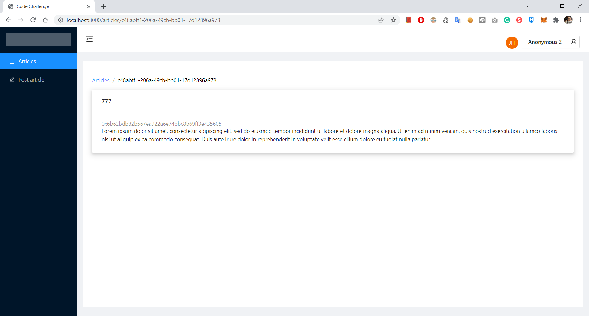

# Demonstration

## Features

1. ✔️ UI for the user to sign-in with Ethereum, via standard wallet such as MetaMask.
2. ✔️ UI that can render list of stored articles, displaying author's address.
3. ✔️ UI for user to submit an article with title and text.
4. ✔️ After the user submit, store the article and display notification stating the request is successful or failed.
5. ✔️ Generate (or redirect to) an URL for the article.
6. ✔️ Pagination of article list.

## Client

There are four major part of UI including Articles List, Create Article, Article View and User Control Panel.

### Usage

Install dependencies

```
$ yarn
```

Start server

```
$ yarn start
```

### Snapshots

If the user enter this app, he will be the `Anonymous` identity before login.


Login with MetaMask and logout


The user can click on the article to go to the article page


Create an article


## Server

It's an article service with GraphQL interface on top of OrbitDB.

Install dependencies

```
$ yarn
```

Development mode

```
$ yarn dev
```

Start server

```
$ yarn start
```

## Auth Server (TBD)

I don't cover the auth service here. But in reality, we will have a separate service.
Here is my design plan:

- Provide the endpoint for login / verify / logout with either REST or GraphQL.
- Support MetaMask address verification.
- Sign a jwt token with user information.
- The other service can use this jwt to identify the user.

### Reference

- [Expressjs User Authentication with MetaMask & meta-auth](https://medium.com/coinmonks/expressjs-user-authentication-with-metamask-meta-auth-630b6da123ef)
